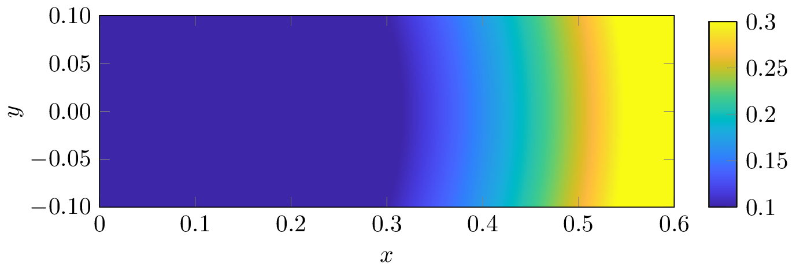

# matlab_surf_tikz

Plotting surface plots using tikz/pgfplots with data coming from matlab has been a pain to me. So I came up with this workaround where I save the contour plot and the colorbar in two different files. Then, the axis and labels are created using tikz/pgfplots.

It requires [export_fig](https://www.mathworks.com/matlabcentral/fileexchange/23629-export_fig/)

The tex file in the example also has the instructions to save to file a png or eps image instead of pdf.
